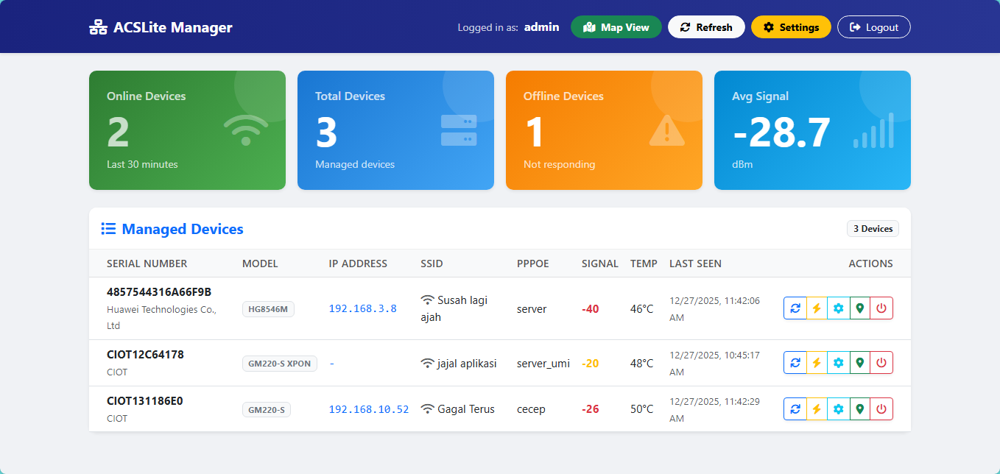
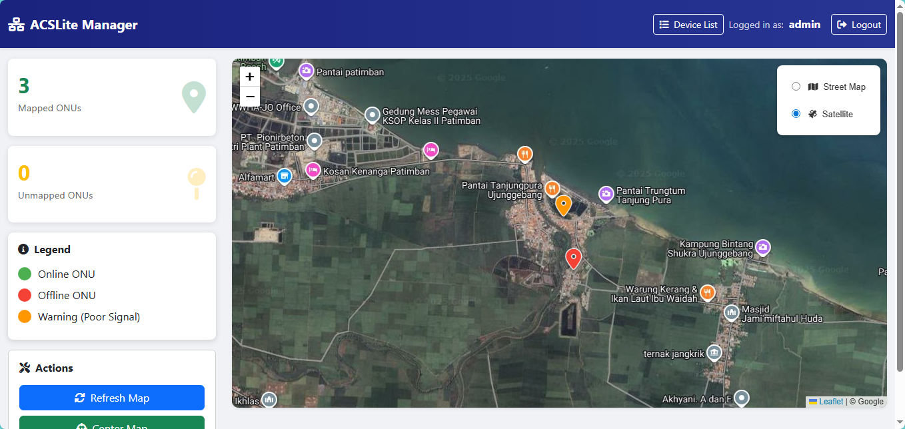
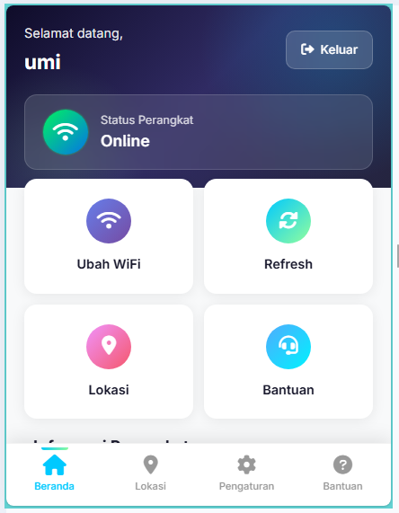

# Go-ACS (ACSLite)

<p align="center">
  
  
  
  
</p>

**Go-ACS** adalah Auto Configuration Server (ACS) berbasis Go untuk manajemen perangkat CPE/ONU menggunakan protokol TR-069 (CWMP). Dilengkapi dengan Customer Portal untuk pelanggan RTRW Net.

## 🚀 Fitur Utama

| Fitur | Deskripsi |
|-------|-----------|
| 📡 **TR-069 ACS** | Manajemen perangkat CPE/ONU secara remote |
| 🗺️ **ONU Mapping** | Peta lokasi semua ONU dengan koordinat GPS |
| 📶 **WiFi Management** | Ubah SSID dan Password WiFi langsung dari dashboard |
| 👥 **Customer Portal** | Login pelanggan untuk melihat status perangkat |
| 📊 **Real-time Monitoring** | Monitor Rx Power, Temperature, Status Online |
| 🔐 **Secure API** | API dengan autentikasi dan CORS support |
| 📱 **Responsive UI** | Dashboard modern yang mobile-friendly |

## 📋 Persyaratan Sistem

- **OS**: Ubuntu 20.04+ / Debian 11+ / Armbian
- **Architecture**: x86_64 (AMD64) atau ARM64
- **RAM**: Minimal 512MB
- **Storage**: Minimal 1GB
- **Database**: MariaDB/MySQL (otomatis diinstall)
- **PHP**: PHP 7.4+ (otomatis diinstall)

## ⚡ Instalasi Cepat

### 1. Download atau Clone Repository

```bash
git clone https://github.com/alijayanet/Go-ACS.git
cd Go-ACS
```

### 2. Jalankan Installer

```bash
chmod +x install.sh
sudo ./install.sh
```

Installer akan otomatis:
- ✅ Install dan konfigurasi MariaDB
- ✅ Buat database dan tabel
- ✅ Install Go ACS Server
- ✅ Install PHP dan PHP API Server
- ✅ Setup systemd services

### 3. Akses Dashboard

Setelah instalasi selesai, akses melalui browser:

| Halaman | URL |
|---------|-----|
| **Admin Panel** | `http://YOUR_IP:7547/web/templates/index.html` |
| **Admin Login** | `http://YOUR_IP:7547/web/templates/login.html` |
| **Map View** | `http://YOUR_IP:7547/web/templates/map.html` |
| **Customer Login** | `http://YOUR_IP:7547/web/templates/customer_login.html` |

## 🔧 Konfigurasi

### 🔐 Admin Credentials

USER="admin"
PASS="admin123"

✅ Go-ACS Installation Complete!

📍 Server: 192.168.1.1
🕐 Time: 2025-12-27 11:00:00
💻 Hostname: server-acs

🌐 Access URLs:
• Admin Panel: http://192.168.1.1:7547/web/templates/index.html

🔐 Admin Credentials:
• Username: admin
• Password: admin123
```

### Service Management

```bash
# ACS Server
sudo systemctl status acslite
sudo systemctl restart acslite
sudo journalctl -u acslite -f

# PHP API Server
sudo systemctl status acs-php-api
sudo systemctl restart acs-php-api
sudo journalctl -u acs-php-api -f
```

## 📁 Struktur Folder

```
/opt/acs/
├── acs                     # Go binary (TR-069 Server)
├── .env                    # Konfigurasi
└── web/
    ├── templates/          # HTML files
    │   ├── index.html      # Admin Dashboard
    │   ├── login.html      # Admin Login
    │   ├── map.html        # ONU Map View
    │   ├── customer_login.html
    │   └── customer_dashboard.html
    ├── api/
    │   └── customer_api.php    # Customer Portal API
    └── data/
        └── customers.json      # Fallback storage
```

## 🌐 API Endpoints

### Go ACS API (Port 7547)

| Method | Endpoint | Deskripsi |
|--------|----------|-----------|
| GET | `/api/devices` | List semua device |
| GET | `/api/stats` | Statistik server |
| POST | `/api/tasks` | Kirim task ke device |

### PHP Customer API (Port 8888)

| Method | Endpoint | Deskripsi |
|--------|----------|-----------|
| GET | `/api/customer_api.php?sn=XXX` | Get device by serial |
| POST | `/api/customer_api.php` | Login / Save location |

## 📡 Konfigurasi CPE/ONU

Konfigurasikan perangkat CPE/ONU Anda dengan ACS URL:

```
http://YOUR_SERVER_IP:7547/
```

### Contoh untuk berbagai vendor:

| Vendor | Path Konfigurasi |
|--------|------------------|
| **Huawei** | `InternetGatewayDevice.ManagementServer.URL` |
| **ZTE** | `InternetGatewayDevice.ManagementServer.URL` |
| **Fiberhome** | `InternetGatewayDevice.ManagementServer.URL` |
| **CIOT** | `InternetGatewayDevice.ManagementServer.URL` |

## 🔐 Keamanan

- Semua API dilindungi dengan API Key
- Password pelanggan di-hash dengan bcrypt
- CSP (Content Security Policy) aktif
- CORS dikonfigurasi dengan benar

## 📸 Screenshots

### Admin Dashboard


### ONU Map View


### Customer Portal


## 🛠️ Troubleshooting

### Service tidak berjalan

```bash
# Cek status
sudo systemctl status acslite
sudo systemctl status acs-php-api

# Lihat log error
sudo journalctl -u acslite -e
sudo journalctl -u acs-php-api -e
```

### Database connection error

```bash
# Test koneksi database
mysql -u root -psecret123 acs -e "SHOW TABLES;"
```

### Port sudah digunakan

```bash
# Cek port yang digunakan
sudo ss -tlnp | grep -E "7547|8888"
```

## 📞 Kontak & Dukungan

Untuk informasi lebih lanjut atau bantuan teknis:

| | |
|---|---|
| 📱 **WhatsApp** | [081947215703](https://wa.me/6281947215703) |
| 🌐 **GitHub** | [github.com/alijayanet/Go-ACS](https://github.com/alijayanet/Go-ACS) |
| 📧 **Issues** | [GitHub Issues](https://github.com/alijayanet/Go-ACS/issues) |

---

## 📜 Lisensi

Project ini dilisensikan di bawah [MIT License](LICENSE).

---

## ⭐ Star Repository

Jika project ini bermanfaat, jangan lupa berikan ⭐ di [GitHub](https://github.com/alijayanet/Go-ACS)!

---

<p align="center">
  <b>Go-ACS</b> - TR-069 Auto Configuration Server<br>
  Dibuat dengan ❤️ untuk RT-RW Net Indonesia
</p>


